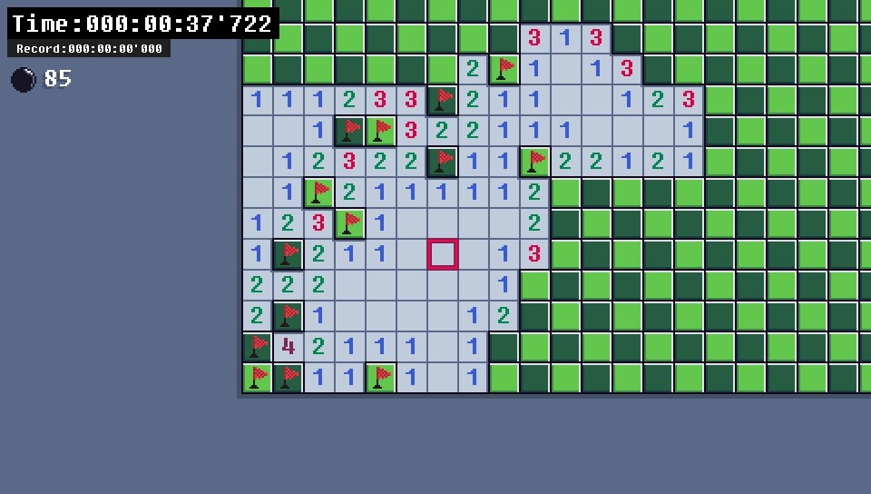
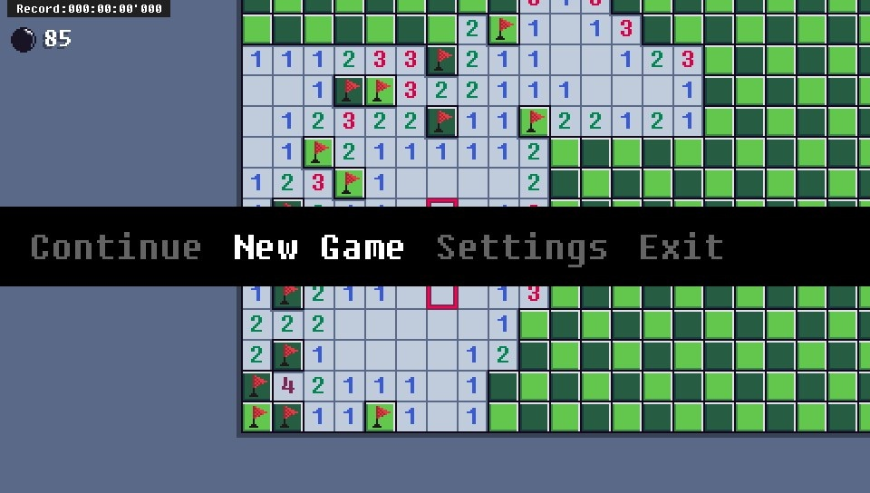
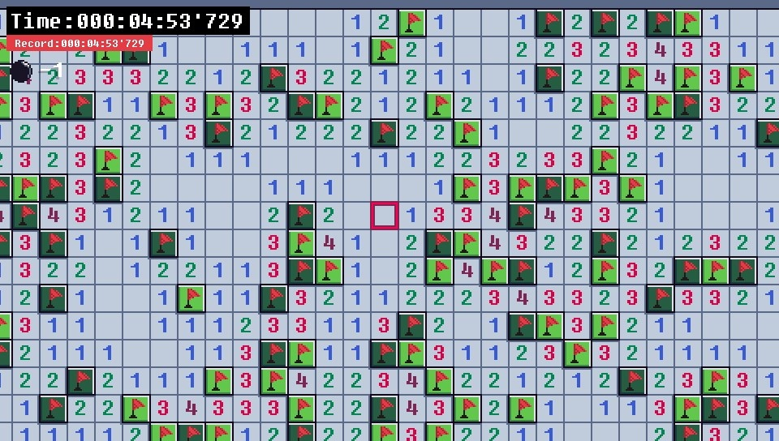

# MSweep
Simple minesweeper written in C++ for PlayStation Vita 

## Features:
* Saves
* Nothing else, yes i am dumb
## How to play:
* <kbd>DPAD</kbd> - Move
* <kbd>Cross</kbd> - Open tile (or open group of tiles if you press on number)
* <kbd>Square</kbd> - Put Question mark
* <kbd>Circle</kbd> - Flag / Unflag
* <kbd>Triangle</kbd> - Recreate level
* <kbd>Start</kbd> - Go to pause menu
## Building
Just build it by typping `cmake .&& make`
### About save
Save file is located in `ux0:data\msweep_save.txt` you can simply edit it 
Here is template : `easy medium hard custom` <b>Do not make extra spaces</b> 
Here is example : `123 456 789 101` time is in milliseconds
## Screenshots
 
 
 
 
## Thanks to:
* [xerpi](https://github.com/xerpi/) - [vita2d](https://github.com/xerpi/libvita2d) 
* [VITASDK team](https://github.com/vitasdk) - VitaSDK
